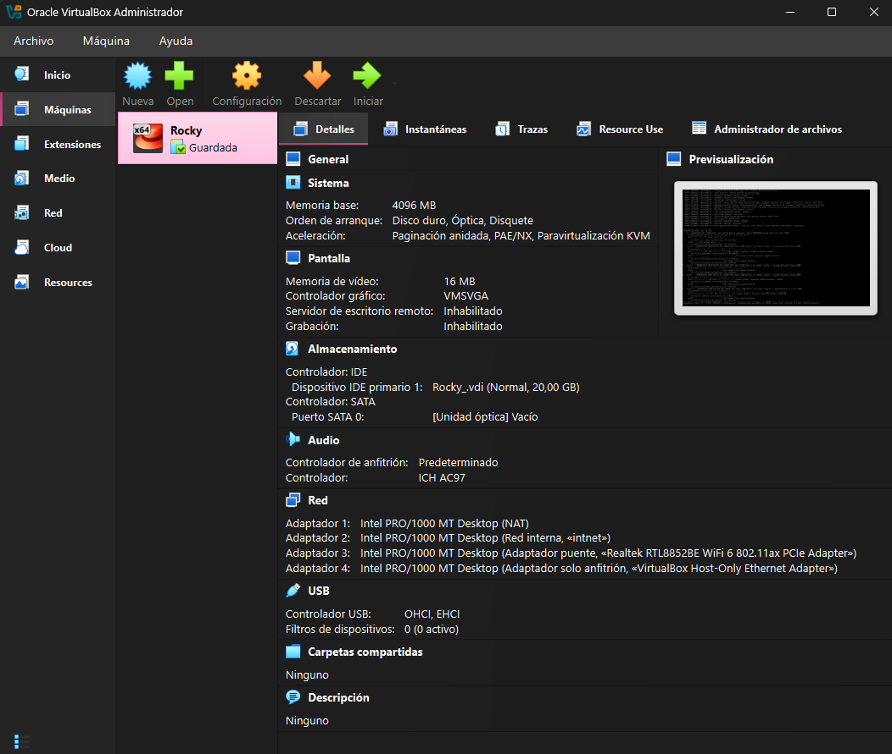

# Objetivos y Requisitos

En esta sección se definen las metas principales de la actividad y los requerimientos de software necesarios.

## 🎯 Objetivos

- Reconocer y gestionar entornos virtuales para la instalación de sistemas operativos.
- Realizar una instalación personalizada de Rocky Linux 9 Minimal en **VirtualBox**.
- Configurar parámetros de red estáticos (IPv4, Gateway y DNS) desde la terminal de Rocky Linux.
- Acceder a la máquina virtual (VM) recién instalada a través de protocolo SSH.

---

## 🛠️ Requisitos Previos y Herramientas Utilizadas

Para llevar a cabo la instalación, se utilizaron los siguientes componentes:

- **Hipervisor:** VirtualBox.
- **Sistema Operativo Invitado:** Rocky Linux 9.
- **Imagen Utilizada:** ISO Minimal (x86_64, AMD64 o Intel 64).

---

[➡️ Siguiente paso: Proceso de Instalación](./02-proceso-instalacion.md)
