# Proceso de Instalación del Sistema Operativo

Esta sección documenta detalladamente los pasos a seguir para instalar Rocky Linux 9. El proceso está pensado para ser seguido por cualquier persona, independientemente de su nivel de experiencia previa, abarcando desde la configuración de la máquina virtual (VM) en VirtualBox hasta la asignación manual de los discos.

## 3.1 Creación y Configuración de la Máquina en VirtualBox

VirtualBox actuará como nuestro "computador virtual". Para crear uno nuevo, sigue estos pasos:

1. Abre **VirtualBox** y haz clic en el botón azul **"Nueva"** (o "New" en inglés).

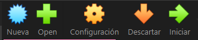

2. Se abrirá un panel con varias secciones desplegables. En la primera sección (**Name and Operating System** o Nombre y Sistema Operativo), configura los siguientes datos iniciales:
   - **Nombre:** Asigna un nombre descriptivo, como `RockyLinux9_Server`.
   - **Carpeta de Máquina:** Deja la ruta por defecto o elige dónde guardarla.
   - **Imagen ISO:** Despliega el menú, selecciona "Otro..." y busca el archivo `.iso` de Rocky Linux 9 que descargaste previamente.

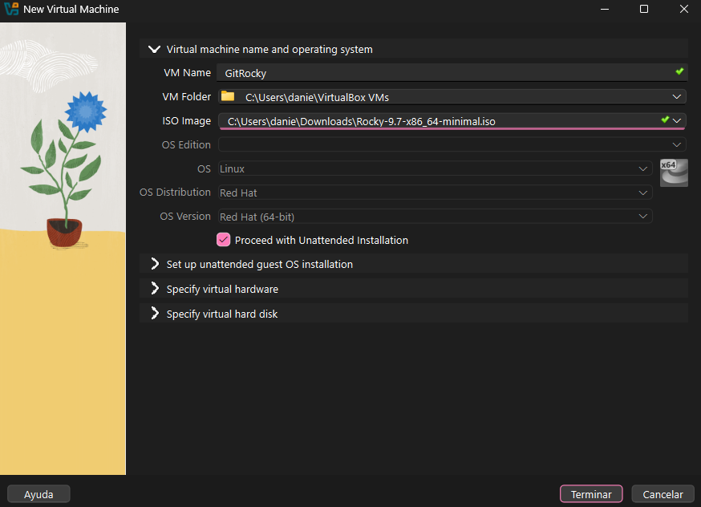

3. Despliega la siguiente sección llamada **Set up unattended guest OS installation** (Instalación desatendida). Aquí VirtualBox te permite adelantar la creación de tu usuario para que la instalación sea más rápida:
   - **Username / Password:** Escribe el nombre de usuario que usarás para administrar el servidor (ej. `daniel`) y asignale una clave segura. Confírmala en la caja de abajo.
   - **Hostname:** Este es el nombre "público" de la máquina en la red. Puedes poner algo como `RockyLinuxPrueba`.

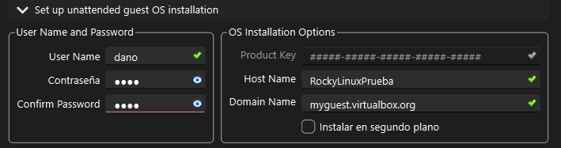

4. Abre la sección de **Hardware** para asignar memoria y procesador:
   - Arrastra el medidor de **Memoria Base (RAM)**. Se recomiendan mínimo **2048 MB (2 GB)**, pero si tu computador tiene 8 GB o más de RAM física, asígnale **4096 MB (4 GB)** para mayor fluidez.
   - En **Procesadores**, asigna al menos **2 CPUs** (siempre y cuando la barra verde te lo permita).

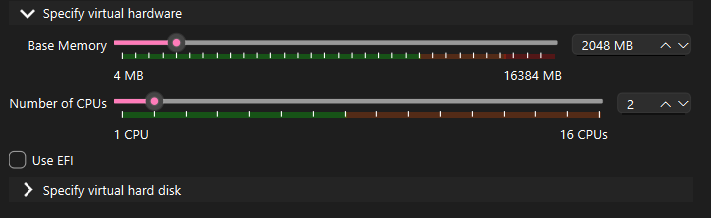

5. Despliega la sección de **Specify virtual hard disk** (Especificar disco duro virtual):
   - Asegúrate de dejar seleccionada la opción **"Create a New Virtual Hard Disk"** (Crear un nuevo disco virtual).
   - En la barra de tamaño (Disk Size), arrastra hasta elegir una capacidad entre **20.00 GB y 30.00 GB**.
   - En **Hard Disk File Type and Format** es altamente recomendable elegir el tipo `VDI (Virtual Disk Image)`, ya que es el formato nativo optimizado de VirtualBox. 
   - Deja **desmarcada** la casilla "Reservar completamente" para ahorrar espacio en tu PC físico (así el disco crecerá de tamaño gradualmente según lo necesite).

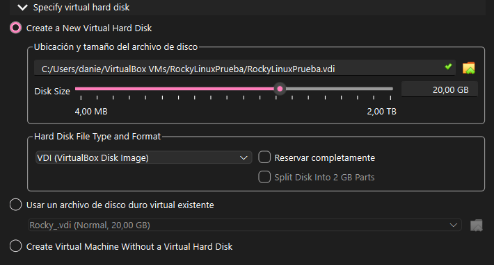

damos terminar y inicia automaticamente la maquina virtual, antes de iniciarla la cerramos para configurar la red

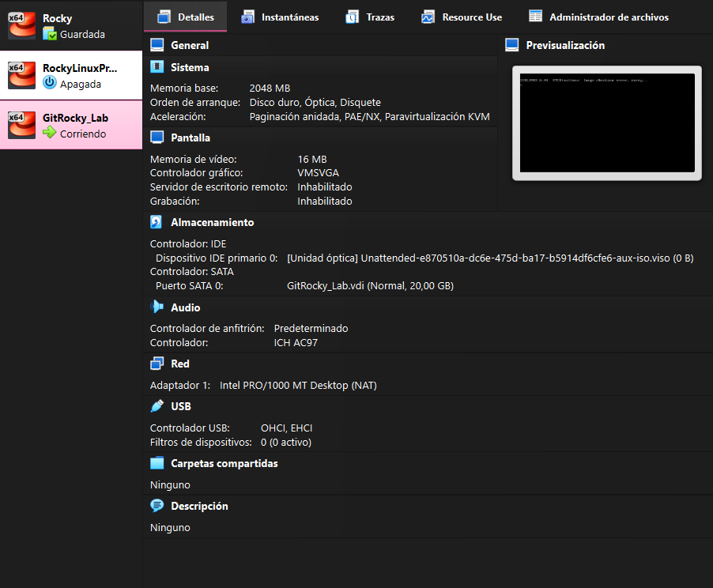

---
## 3.2 Ajustes de Red Antes de Iniciar

Antes de encender la máquina, necesitamos decirle a VirtualBox cómo conectar esta VM al internet de tu casa o laboratorio.

1. Selecciona tu nueva máquina `RockyLinux9_Server` en el menú izquierdo de VirtualBox.
2. Haz clic en el engranaje amarillo de **Configuración** (Settings).
3. Ve al apartado de **Red** (Network) en el menú lateral izquierdo.

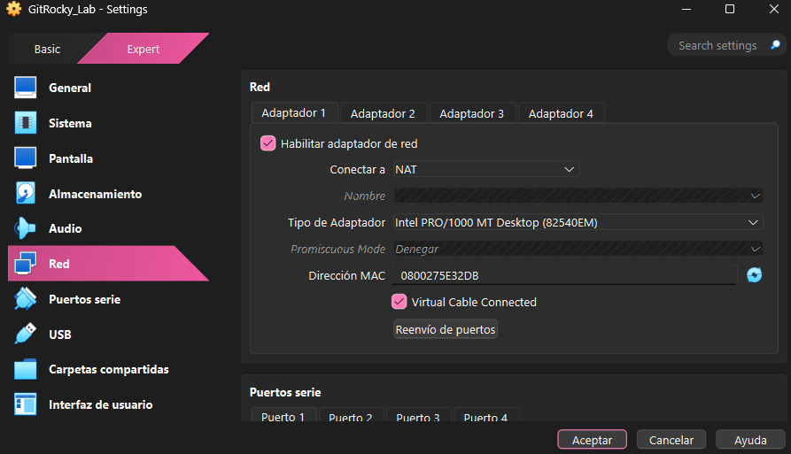

4. En el **Adaptador 1**, asegúrate de que esté habilitado.
5. En **Conectado a:**, despliega el menú y selecciona **Adaptador Puente** (Bridged Adapter). Esto le permitirá a la VM recibir una IP real de tu router, tal como tu computador físico. *(Nota: Si presentas problemas o estás en un entorno restringido, puedes usar "NAT" o "Red Interna" según la topología deseada).*

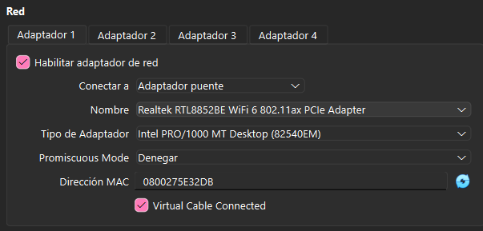

6. Haz clic en **Aceptar**.

---

## 3.3 Inicio del Instalador 

¡Es hora de encender el equipo!

1. Selecciona tu VM y presiona la flecha verde **Iniciar**.

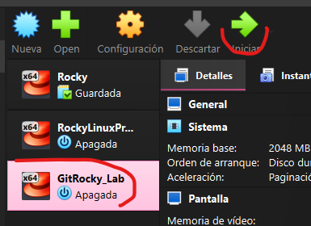

2. Al arrancar, verás un menú con letras azules sobre fondo negro. Usa las flechas de tu teclado para seleccionar **"Install Rocky Linux minimal 9.7"** (Instalar Rocky Linux) y presiona **Enter**.

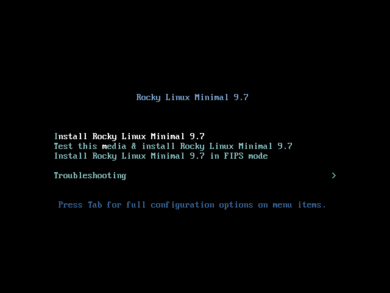
3. Espera a que el sistema cargue la interfaz gráfica. 
4. La primera pantalla te pedirá el **Idioma**. Busca "Español" o mantenlo en "English" según tu preferencia. Haz clic en **Continuar**.

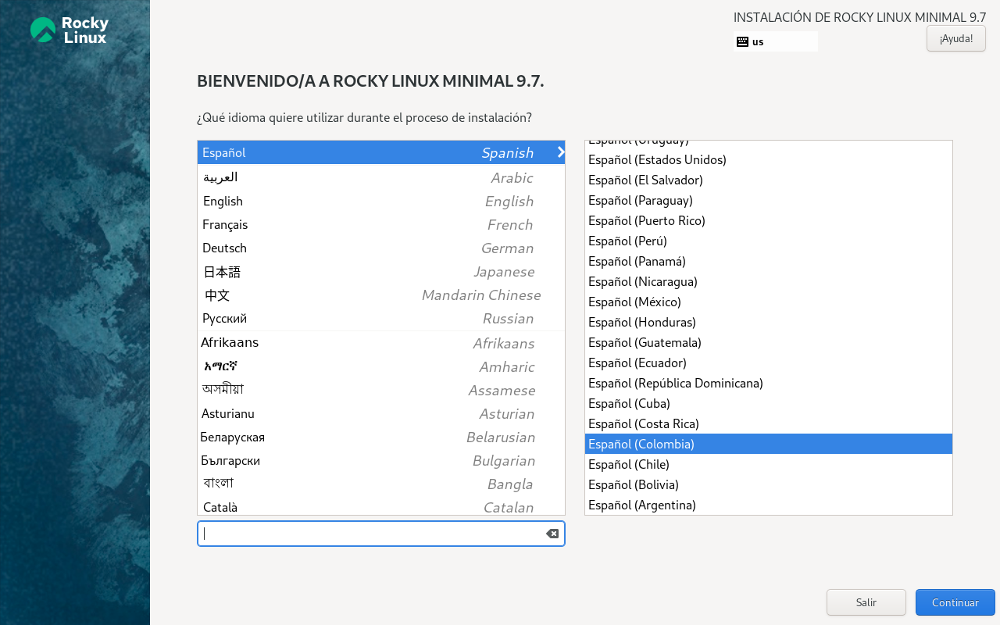

---

## 3.4 Resumen de la Instalación y Particionamiento Manual

### Destino de la Instalación (Particionamiento)
En lugar de dejar que Linux borre el disco y lo estructure como él quiera, vamos a configurarlo manualmente paso a paso.

1. Haz clic en **Destino de la instalación** (Installation Destination).

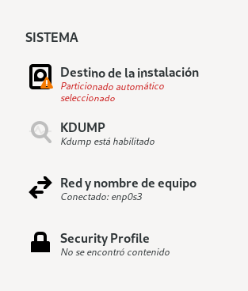

2. Asegúrate de que tu disco virtual (ej. 20 GB ATA VBOX) tenga un "check" (✔️).
3. En la parte inferior, bajo "Configuración de almacenamiento" (Storage Configuration), selecciona la opción **Personalizada** (Custom).

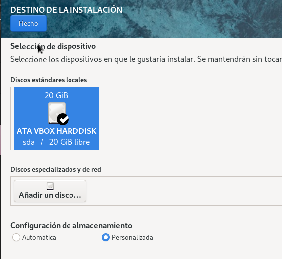

4. Haz clic en **Hecho** (Done).

Se abrirá una nueva herramienta de particionamiento. Haz clic en la lista desplegable de la izquierda que dice "LVM" y cámbiala a **Partición Estándar** (Standard Partition). 

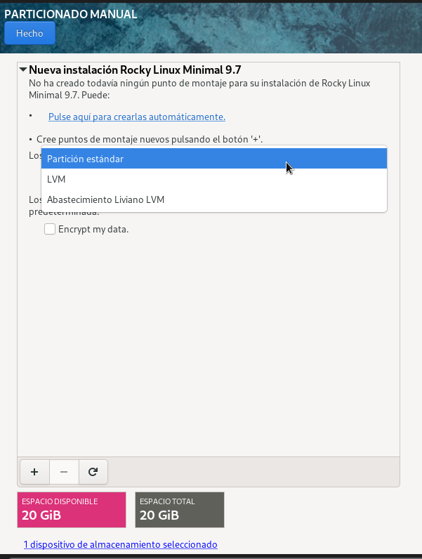

Ahora, usando el botón del **más (+)** en la esquina inferior izquierda, vamos a crear tres "rebanadas" en el disco de forma manual:

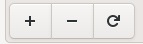

**1. La Partición de Arranque (Boot):**
- Punto de montaje: `/boot`
- Capacidad deseada: `250 MiB` o `500 MiB`

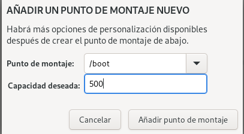
- Haz clic en "Añadir punto de montaje". Esta partición albergará el núcleo (kernel) que enciende el sistema.

**2. La Memoria de Intercambio (Swap):**
- Punto de montaje: `swap`
- Capacidad deseada: `2 GiB` *(Nota: Se calcula en base a tu RAM. Si pusiste 4GB de RAM, puedes asignar 2GB o 4GB de Swap)*.
- Haz clic en "Añadir punto de montaje". Esta área sirve como apoyo al disco duro en caso de que la RAM física se llene.

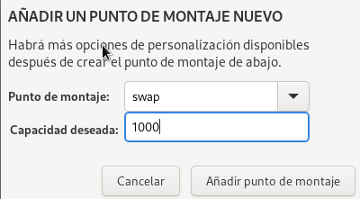

**3. La Raíz del Sistema (Root):**
- Punto de montaje: `/` (Sólo un slash)
- Capacidad deseada: *(Déjalo completamente en blanco).*
- Al dejarlo en blanco vacío y darle a "Añadir", Linux tomará **todo el espacio que sobra** (ej. 17 GB) y se lo asignará automáticamente al sistema operativo, archivos y carpetas del usuario.

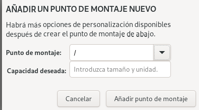

Una vez configuradas las tres particiones, haz clic en **Hecho** arriba a la izquierda. Aparecerá una ventana de advertencia de "Resumen de Cambios". Haz clic en **"Aceptar cambios"**.

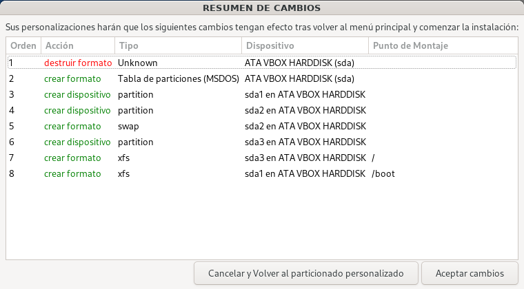

---

## 3.5 Creación de Contraseñas y Usuarios

Por motivos de seguridad, todo servidor en Linux necesita un administrador maestro (Root) y se aconseja tener un usuario estándar de uso habitual.

1. En el menú principal, desliza hasta el fondo. Verás un apartado de **Ajustes de usuario**.

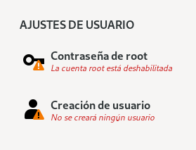

1. Haz clic en **Contraseña de root**. Asigna una contraseña que recuerdes muy bien *(ej. root123 para prácticas, nunca en la vida real)*. Debes marcar la opción de permitir el acceso por SSH al root. Si la contraseña es débil, deberás presionar "Hecho" dos veces.

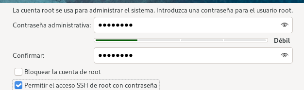

2. Haz clic en **Creación de usuario**.
3. Escribe tu nombre o nombre de administrador (ej: `daniel`). Asigna una contraseña y asegúrate de marcar la casilla **"Hacer a este usuario administrador"**.
4. Haz clic en **Hecho**.

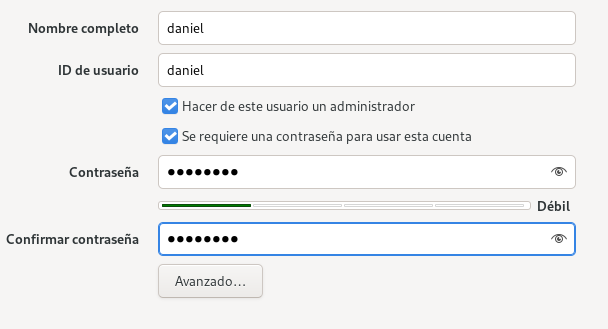

---

## 3.6 Iniciar la Instalación

1. Regresa a la pantalla de Resumen.
2. Haz clic en el botón azul de la esquina inferior derecha: **"Comenzar instalación"** (Begin Installation).

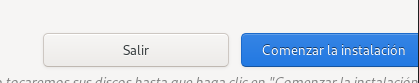

3. Verás una barra de progreso que indica que se están descargando e instalando los paquetes. Este proceso puede tomar varios minutos.

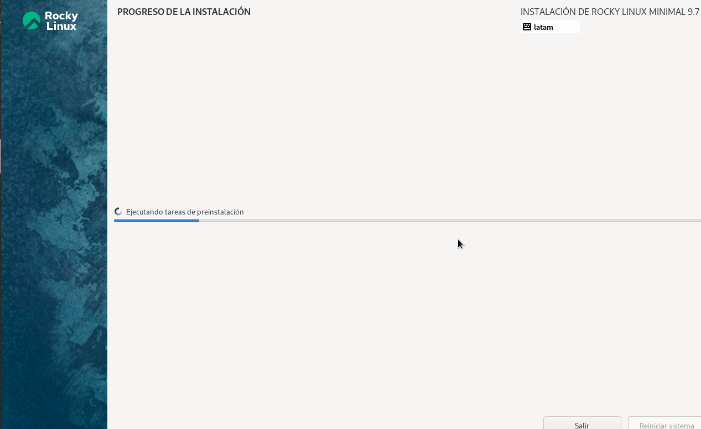

4. Cuando termine, el botón inferior cambiará a **"Reiniciar sistema"** (Reboot System). Haz clic en él y espera que la pantalla negra te solicite `localhost login:`. ¡El sistema se ha instalado con éxito!

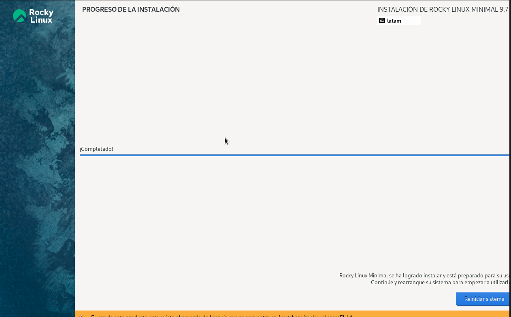

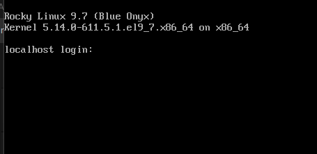

---
[⬅️ Anterior: Objetivos y Requisitos](./01-objetivos-requisitos.md) | [➡️ Siguiente: Configuración de Red por CLI](../02-red/01-configuracion-nmcli.md)
