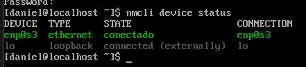
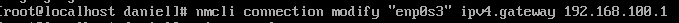
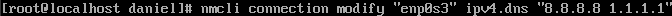
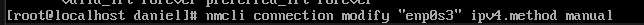
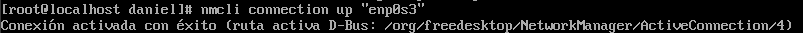
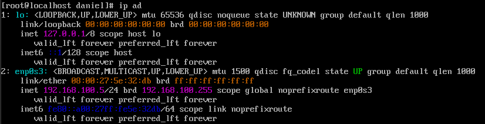
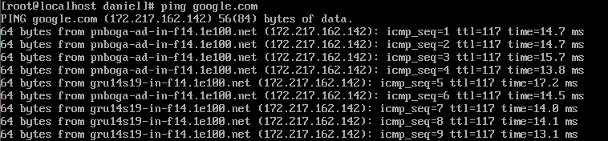

# Configuración de Red por Línea de Comandos (CLI)

Una vez completada la instalación y tras el primer arranque, el sistema se encontraba sin red configurada o dependiente de asignación dinámica (DHCP). Para propósitos de este laboratorio y simular un entorno empresarial real, un servidor Linux **nunca debe cambiar de IP**.

Por lo anterior, se optó por configurar una **dirección IP estática** (incluyendo Máscara, Puerta de Enlace y servidores DNS) de forma manual. 

En Rocky Linux, el comando recomendado para gestionar las redes a nivel de servidor es **NetworkManager Command Line Interface (`nmcli`)**.

> ⚠️ **¡IMPORTANTE! Permisos de Administrador**  
Para ejecutar cualquier cambio en la red del equipo, *debes poseer privilegios*. Si al ejecutar los comandos obtienes un error tipo `Error checking authorization: GDBus.Error... ServiceUnknown`, significa que estás con un usuario normal.
Para solucionarlo, eleva tus privilegios escribiendo `sudo su -` (y tu contraseña) antes de continuar, o asegúrate de anteponer la palabra `sudo` a todos los comandos `nmcli` que verás abajo.

---

## 4.1 Identificación de las Tarjetas de Red

Antes de asignarle una dirección a nuestro equipo, debemos saber cómo llama el sistema a nuestra tarjeta de red (ej. *Ethernet, Wi-Fi, etc.*).

1. Escribe el siguiente comando y presiona `Enter`:
```bash
nmcli device status
```
2. Aparecerá una tabla. En la columna `DEVICE` (Dispositivo), busca el nombre que tenga el tipo `ethernet` (generalmente es algo como `enp0s3` o `ens33`). En la columna `STATE` (Estado), dirá si está conectada o desconectada.




---

## 4.2 Configuración Estática Paso a Paso

A continuación, usaremos `nmcli` indicándole la "Conexión a modificar" (modify), el nombre de tu tarjeta de red, y el parámetro específico (por ejemplo, el DNS). 

**Sustituye `enp0s3` por el nombre real de tu tarjeta si es diferente.**

### Asignar la Dirección IP y Máscara

Al usar "Adaptador Puente" en VirtualBox, tu servidor Rocky Linux debe pertenecer a la **misma red** que tu computador físico.

1. En tu Windows o Mac, revisa cuál es tu segmento de red abriendo la consola y escribiendo `ipconfig` (o `ifconfig`).
2. Busca tu **"Puerta de Enlace Predeterminada"**. Supongamos que dice `192.168.100.1`. Esto significa que estás en la red `100`.
3. Dale a tu servidor una IP que esté libre dentro de esa red, por ejemplo, la `.5`.

Para este ejemplo, le asignaremos la IP en el segmento `100`:
```bash
sudo nmcli connection modify "enp0s3" ipv4.addresses 192.168.100.5/24
```


### Asignar la Puerta de Enlace (Router)
Esta es la ruta por la cual tu servidor podrá salir a Internet. Debe coincidir exactamente con la Puerta de Enlace Predeterminada que viste en el paso de tu computador físico.
```bash
sudo nmcli connection modify "enp0s3" ipv4.gateway 192.168.100.1
```



### Asignar los Servidores de Nombre (DNS)
Los DNS traducen los nombres (ej. Google.com) a números IP. Utilizaremos los DNS públicos de Google y Cloudflare. Notarás que van entre comillas y separados por un espacio.
```bash
sudo nmcli connection modify "enp0s3" ipv4.dns "8.8.8.8 1.1.1.1"
```


### Cambiar Método a "Manual"
Por defecto, Linux intentará usar "Auto" o DHCP para pedir una IP. Debemos forzar el cambio a nuestro modo estático.
```bash
sudo nmcli connection modify "enp0s3" ipv4.method manual
```



---

## 4.3 Aplicación de Cambios y Verificación

Para que las configuraciones anteriores surtan efecto, debes "reiniciar" u "ordenar que suba" la tarjeta de red.

### Reiniciar Tarjeta Lógica:
```bash
sudo nmcli connection up "enp0s3"
```
Verás un mensaje que dice: `Connection successfully activated...` (Conexión activada exitosamente).


### Consultar Estado de la Red:
Usa uno de los dos siguientes comandos para verificar que tu servidor ya tiene la IP manual `192.168.100.5`.
```bash
ip add
# o
ip a
```
Bajo tu placa de red `enp0s3`, verás un bloque de texto donde dirá explícitamente `inet 192.168.100.5/24`.


### Prueba Constante (Ping):
Vamos a corroborar que nuestro servidor Linux tenga salida hacia el exterior enviando paquetes de datos a Google de forma indefinida con el comando Ping.
```bash
ping google.com
```




> ⚠️ **¿Qué hacer si sale un error de "Nombre o servicio desconocido"?**  
Si tu consola dice algo como `ping: google.com: Nombre o servicio desconocido`, significa que el DNS o el Gateway están fallando. Asegúrate de dos cosas vitales:
1. **Tu Red Física:** Tu computador host debe estar conectado a internet.
2. **Tu Gateway (Puerta de Enlace):** Revisa que la dirección `ipv4.gateway` que configuraste (ej. `192.168.1.1`) sí corresponda a **la red real de tu casa**. Puedes revisar la IP de tu computador físico buscando en su consola comandos como `ipconfig` en Windows (busca la puerta de enlace predeterminada y pon esa misma IP en `nmcli`).
>
Si cambias algún parámetro con `nmcli`, recuerda siempre reiniciar la tarjeta o los cambios no se aplicarán:
`sudo nmcli connection down "enp0s3" && sudo nmcli connection up "enp0s3"`

Deberías ver que la consola escribe línea tras línea los "bytes" recibidos, confirmando que la red está completamente operativa. *Para detener el comando, presiona en tu teclado las teclas `Ctrl + C`*.


---
[⬅️ Anterior: Proceso de Instalación](../01-instalacion/02-proceso-instalacion.md) | [➡️ Siguiente: Acceso Remoto por SSH](../03-ssh/01-acceso-remoto.md)
