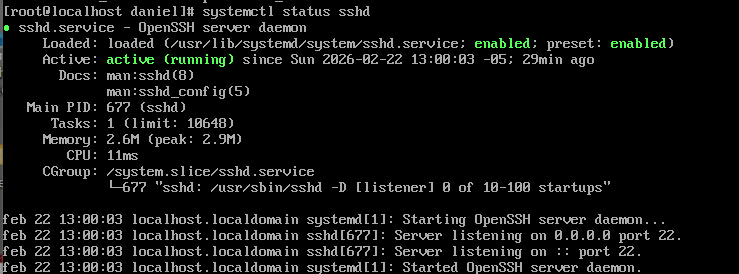
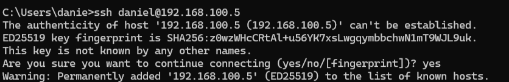
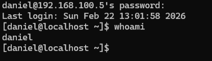

# Acceso a la Máquina Virtual a Través de SSH

Con la interfaz de red estabilizada y funcionando mediante la IP estática `192.168.100.5`, estamos listos para conectar nuestro servidor a las "grandes ligas".

Administrar un servidor viendo la pantalla pequeña y limitante de VirtualBox es tedioso, por lo que usaremos algo llamado **SSH (Secure Shell)**. El servicio SSH viene preinstalado en Rocky Linux, y nos permite tomar el control total del servidor virtual desde la consola o terminal original de nuestro computador físico, de forma cifrada y muy ágil.

## 5.1 Comprobación del Servicio SSH en el Servidor (VirtualBox)

Antes de abandonar la ventana de VirtualBox, asegurémonos de que SSH esté encendido (Activo) en la máquina virtual. Escribe el comando:

```bash
systemctl status sshd
```

En la salida deberás buscar una línea verde brillante que diga `Active: active (running)`. Si está activo presiona la tecla `q` para salir y regresar a la línea de comandos normal.


## 5.2 Estableciendo la Conexión Remota (Desde el Host Físico)

Ya puedes minimizar la ventana negra de VirtualBox (pero **no** vayas a apagar la máquina, déjala corriendo de fondo).

1. Abre el programa de comandos nativo de tu computador físico. (En Windows busca "Símbolo del sistema" o "PowerShell". En Mac abre "Terminal").
2. Utiliza la siguiente estructura para conectarte cifradamente al servidor:

   ```bash
   ssh [NOMBRE_USUARIO]@[DIRECCION_IP]
   ```

   **Por ejemplo**, si durante la instalación (Sección 3.5) llamaste a tu usuario administrador "daniel", teclea:

   ```bash
   ssh daniel@192.168.100.5
   ```

3. Como es la primera vez que interactúas con esa máquina, el sistema de tu computador te lanzará una advertencia de seguridad *(The authenticity of host...)* indicando que la huella (fingerprint) no está en tus registros. Escribe la palabra **`yes`** (en inglés) y presiona Enter.



4. Por último, ¡se te pedirá la contraseña! Escribe la clave *(Nota: los caracteres no aparecerán en pantalla, pero se están digitando)* y presiona Enter.

¡Felicidades! Si la información es correcta, tu consola de Windows/Mac habrá cambiado el nombre al de tu servidor Rocky Linux y toda orden dada a partir de ahora se ejecutará sobre la máquina virtual. 

Para validarlo, ejecuta el comando "Quién soy yo":
```bash
whoami
```



---
[⬅️ Anterior: Configuración de Red por CLI](../02-red/01-configuracion-nmcli.md) | [➡️ Siguiente: Conclusiones y Dificultades](../04-conclusiones/01-informe-final.md)
